# 📡 MOS Differential Amplifier Experiment
## 🎯 Aim
Design and analyze MOS differential amplifier circuit for the following specifications:
- Vdd = 3.2V
- Power Consumption (P) ≤ 2.8mW
- Common-mode input voltage (Vicm) = 1.6V
- Common-mode output voltage (Vocm) = 1.7V
- (Vp) = 0.6V

The analysis includes:

✅ DC Analysis – Design of Rd, Rss

✅ Transient Analysis

✅ AC Analysis

## First Circuit

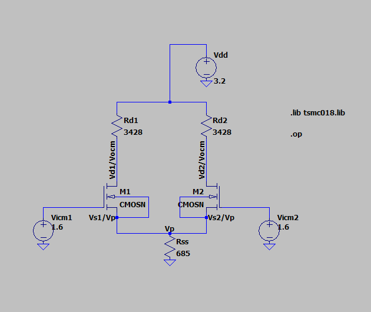

## 🔍 A. DC Analysis
Let Iss be the current flowing throught Rss and Id1 & Id2 be the current flwowing throught NMOS 1 and 2.

**Finding Rd1, Rd2 and Rss**

Here,

P ≤ 2.8mW

We know that, P = VI, Iss = P/Vdd = 2.8mW/3.2V = 0.875mA

Therefore, **Iss = 0.875mA**

From the given parameters we can see that Vd1 = Vd2 = 1.7V (which is the Vocm) , Vg1 = Vg2 = 1.6V (which is the Vicm) and Vs1 = Vs2 = 0.6V (which is the Vp) we can
conclude that the MOSFET is symmetrical and hence Id1 = Id2.

So, Id1 = Id2 = Iss/2 = 0.4375mA

Then, Rd1 = Rd2 = (Vdd - Vocm)/Id1 = 3428Ω

And Rss = Vp/Iss = 685Ω

Also,

Vds = Vocm - Vp = 1.1V

Vgs = Vicm - Vp = 1V

**Hence, Iss = 0.875mA, Id1 = Id2 = 0.4375mA, Rd1 = Rd2 = 3428Ω and Rss = 685Ω**

**With Q-point (0.4375mA, 1.1V)**

## 🔬 Procedure for simulation in LTSpice
1. Set up the circuit and give the value for the resistors based on the above analysis.
2. Go to the Spice directive for including the **tsmc018.lib** and write **".lib tsmc018.lib"**. **(Note that this library file should be on the same directory as your ltspice file)**
3. Now right click on the MOSFET and set the value of the channel length and width of the MOSFET as **L** and **W** respectively.
4. Let's set the value of L and determine the corresponding value of W where Id = 0.4375mA. In the SPICE directive, write **".param L 180nm"** to set the channel length to 180nm.
    Then, add another SPICE directive: **".step param W 1um 50um 1.5um"**, which sweeps the channel width (W) from 1µm to 50µm with a step increment of 1.5µm.
5. Click on the run icon and select the **"DC op pnt"**, you will see the co-ordinate plane which is blank. Now place your cursor on the wire near the drain and click on it.
   (This selected parameter should be current not the voltage). Now you will see the graph.
6. Right click on the graph and select **"Add_Traces"** the give the value of Id there i.e, 0.4375mA. Then trace the intersection of both the line by pressing **c** on your
   keyboard. On the popup window you will see the width of the channel which is **2.525µ.**
7. Now set the width and length of the MOSFET and remove **".step param W 1um 50um 1.5um"** and **".param L 180nm"**.
8. Then click on the run icon, you will get :-

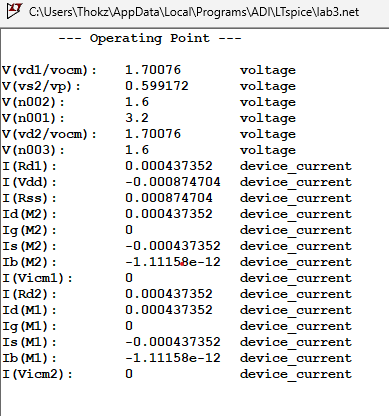

Here we can see Id = 0.437353mA , Vds = 1.7-0.59 = 1.1V (Vds = Vd-Vs), Vp = 0.599172V and Vocm = 1.70076V ,which is approx. eqaul to the analysis we have done.

## 🔍 B. Transient Analysis.
**🔬 Procedure for Transient analysis in LTSpice**
1. Remove the **".op"**.
2. Right click on the Vicm1 and select **"Advanced"**.
3. Then on the function select **"SINE"**.
4. Set DC offset = 1.6V, Amplitude = 50mV and Frequency = 1kHz.
5. Then click "ok".
6. Run the simulation by selecting **"Transient"** mode and setting Stop time as 5ms (Since freq = 1kHz, time period = 1ms and this 5ms simulation time allows you to capture 5 full cycles of the sine wave.
7. You will get:-

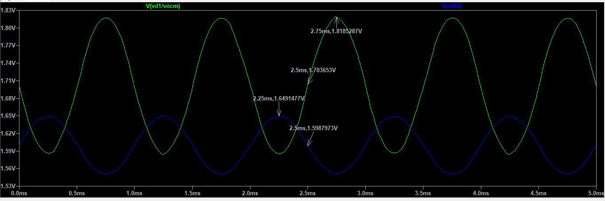

Here we can see that the amplitude of the output waveform is 1.818528-1.7036 = 0.114875V. The input amplitude is 50mV so Gain, Av = -Vout/Vin = -0.114875V/50mV = -2.2975.
Therefore, **Gain,Av = -2.2975**.

## 🔍 C. AC Analysis.
**🔬 Procedure for AC analysis in LTSpice**
1. Right click on the Vicm1 and on the Small signal AC Analysis set Amplitude = 1. (Amplitude = 1 is a standard practice because Gain, Av = -Vout/Vin and  Vin (AC Amplitude) = 1V, then
   Gain=Vout
2. Click on the run icon and select the AC Analysis mode.
3. Set Type of sweep = Decade, Number of points per decade = 20 and Start frequency = 1Hz and Stop frequency = 1THz.
4. Click "ok".
5. Then you will get :-

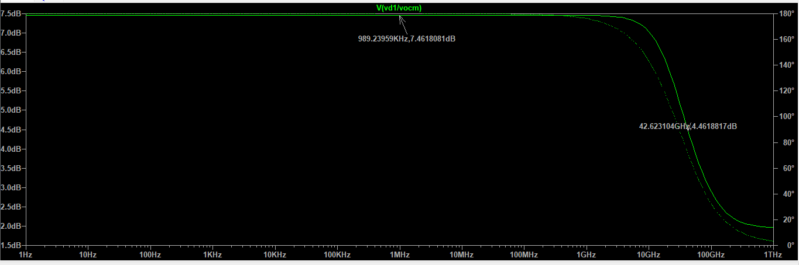

From here we can see that the max midband gain is 7.4618081dB and on subtracting 3dB we can see the gain as 4.4618dB.
So, **20log(Av) = 20log(2.2975)=7.2251dB**. This value is close to the maximum midband gain, confirming the consistency of the calculation.

------------------------------------------------------------------------------------------------------------------------------------------------------------------------------

## Second Circuit

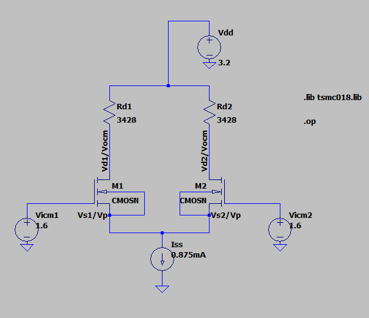

## 🔍 A. DC Analysis
Here current source Iss = 0.875mA is applied as Rss was setting Iss = 0.875mA using voltage division. 
Since a current source directly forces a specific current, it must match this value to maintain the same operating point.

**Finding Rd1, Rd2 and Rss**

Similarly as previous circuit,

at Iss = 0.875mA, P = 2.8mW

And, Id1 = Id2 = Iss/2 = 0.4375mA

Then, Rd1 = Rd2 = (Vdd - Vocm)/Id1 = 3428Ω

Also,

Vds = Vocm - Vp = 1.1V

Vgs = Vicm - Vp = 1V

**Hence, Iss = 0.875mA, Id1 = Id2 = 0.4375mA and Rd1 = Rd2 = 3428Ω**

**With Q-point (0.4375mA, 1.1V)**

## 🔬 Procedure for simulation in LTSpice
1. Set up the circuit and give the value for the resistors based on the above analysis.
2. Go to the Spice directive for including the **tsmc018.lib** and write **".lib tsmc018.lib"**. **(Note that this library file should be on the same directory as your ltspice file)**
3. Now right click on the MOSFET, set the value of the channel length and width of the MOSFET same as previous circuit i,e L=180nm and W=2.525µ.
4. Then click on the run icon, you will get :-

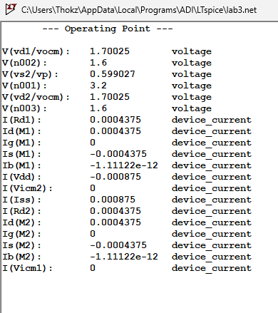

Here we can see Id = 0.4375mA , Vds = 1.70025-0.599027 = 1.1V (Vds = Vd-Vs), Vp = 0.599172V and Vocm = 1.70025V ,which is eqaul to the analysis we have done.

## 🔍 B. Transient Analysis.
**🔬 Procedure for Transient analysis in LTSpice**
1. Remove the **".op"**.
2. Right click on the Vicm1 and select **"Advanced"**.
3. Then on the function select **"SINE"**.
4. Set DC offset = 1.6V, Amplitude = 50mV and Frequency = 1kHz.
5. Then click "ok".
6. Run the simulation by selecting **"Transient"** mode and setting Stop time as 5ms (Since freq = 1kHz, time period = 1ms and this 5ms simulation time allows you to capture 5 full cycles of the sine wave.
7. You will get:-

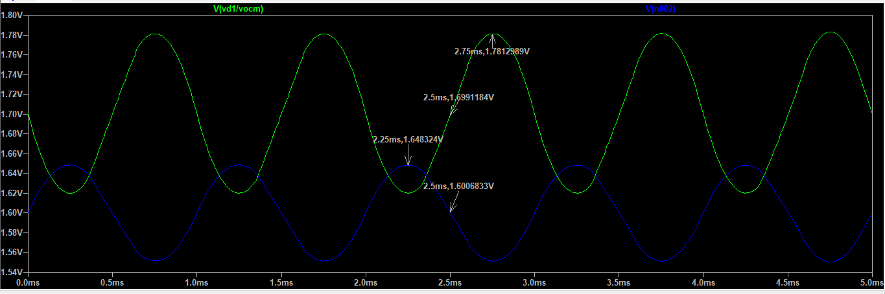

Here we can see that the amplitude of the output waveform is 1.7812989-1.6991184 = 0.0821805V. The input amplitude is 50mV so Gain, Av = -Vout/Vin = -0.0821805V/50mV = -1.64361.
Therefore, **Gain,Av = -1.64361**.

## 🔍 C. AC Analysis.
**Procedure for AC analysis in LTSpice**
1. Right click on the Vicm1 and on the Small signal AC Analysis set Amplitude = 1. (Amplitude = 1 is a standard practice because Gain, Av = -Vout/Vin and  Vin (AC Amplitude) = 1V, then
   Gain=Vout
2. Click on the run icon and select the AC Analysis mode.
3. Set Type of sweep = Decade, Number of points per decade = 20 and Start frequency = 1Hz and Stop frequency = 2THz.
4. Click "ok".
5. Then you will get :-

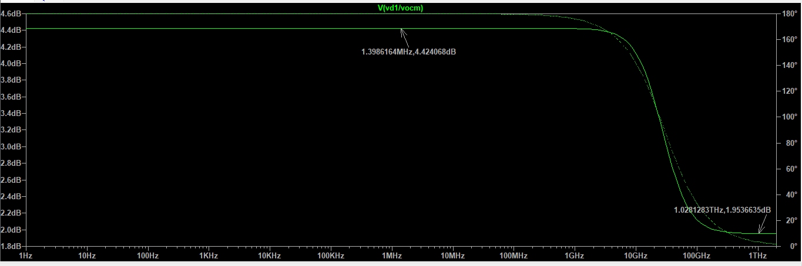

From the analysis, we observe that the maximum midband gain is 4.424068 dB, and after subtracting 3 dB, the expected gain should be 1.4618 dB. However, the gain instead flattens at 1.9536 dB. This deviation is due to the intrinsic parasitic capacitances of the MOSFETs and their interaction with the resistances in the circuit. These parasitic capacitances introduce extra poles in the frequency response causing such effect.
So, **20log(Av) = 20log(1.64361)=4.315975dB**. This value is close to the maximum midband gain, confirming the consistency of the calculation.

-----------------------------------------------------------------------------------------------------------------------------------------------------------------------------

## Third Circuit

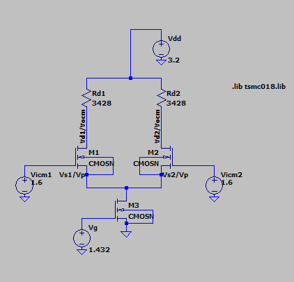

## 🔍 A. DC Analysis
In this circuit, an NMOS transistor (M3) is used in place of the current source (Iss) and resistor (Rss). However, to maintain the same operating point, 
the drain current of M3 must still be equal to Iss = 0.875mA.

Since the circuit remains symmetrical, the values of Rd1 and Rd2 remain unchanged at 3428Ω. This is because the same drain currents (Id1 and Id2) continue
to flow through the differential pair, and the voltage conditions remain the same.

Also,

Vds = Vocm - Vp = 1.1V

Vgs = Vicm - Vp = 1V

But we have to set the voltage Vg of M3 for drain current 0.875mA to flow. For this :-
1. Set up the circuit and give the value for the resistors based on the above analysis.
2. Set the voltage of Vg = {V}'.
3. Go to the Spice directive and write **".lib tsmc018.lib"** and **".step param V 0V 5V"**.
4. Now right click on the MOSFET, set the value of the channel length and width of the MOSFET same as previous circuit i,e L=180nm and W=2.525µ.
5. Then run the simulating in DC op pnt mode, a co-ordinate plane will popup now bring the cursor on the wire near the drain of MOSFET M3 and select the current.
6. On the graph right click, select **"Add Traces"** and give the value of the drain current of MOSFET M3 (0.875mA) there.
7. Use **"Place_Cursor on Active Trace"** using the cursor we find the intesection of this two line as 1.432V, which is the gate voltage Vg of MOSFET M3.
8. Set the Vg = 0.875mA for the M3 MOSFET.
9. Then click on the run icon, you will get :-

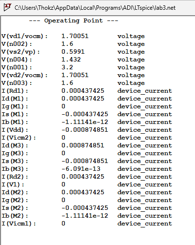

Here we can see Id = 0.437425mA , Vds = 1.70051-0.5991 = 1.1V (Vds = Vd-Vs), Id(M3)=0.874851V Vp = 0.5991V and Vocm = 1.70051V ,which is equal to the analysis we have done.

## 🔍 B. Transient Analysis.
**🔬 Procedure for Transient analysis in LTSpice**
1. Remove the **".op"**.
2. Right click on the Vicm1 and select **"Advanced"**.
3. Then on the function select **"SINE"**.
4. Set DC offset = 1.6V, Amplitude = 50mV and Frequency = 1kHz.
5. Then click "ok".
6. Run the simulation by selecting **"Transient"** mode and setting Stop time as 5ms (Since freq = 1kHz, time period = 1ms and this 5ms simulation time allows you to capture 5 full cycles of the sine wave.
7. You will get:-

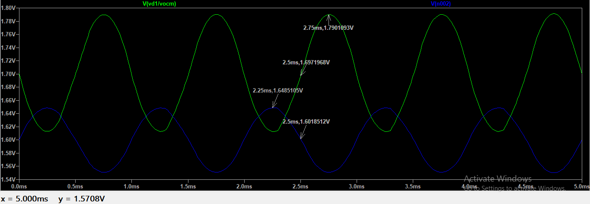

Here we can see that the amplitude of the output waveform is 1.7901093-1.6971968 = 0.0929125V. The input amplitude is 50mV so Gain, Av = -Vout/Vin = -0.0929125V/50mV = -1.85825.
Therefore, **Gain,Av = -1.85825**.

## 🔍 C. AC Analysis.
**🔬 Procedure for AC analysis in LTSpice**
1. Right click on the Vicm1 and on the Small signal AC Analysis set Amplitude = 1. (Amplitude = 1 is a standard practice because Gain, Av = -Vout/Vin and  Vin (AC Amplitude) = 1V, then
   Gain=Vout
2. Click on the run icon and select the AC Analysis mode.
3. Set Type of sweep = Decade, Number of points per decade = 20 and Start frequency = 1Hz and Stop frequency = 2THz.
4. Click "ok".
5. Then you will get :-

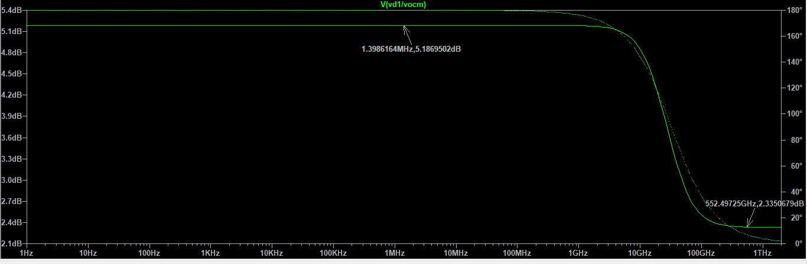

From the analysis, we observe that the maximum midband gain is 5.1869502dB, and after subtracting 3 dB, the expected gain should be 2.1869502dB. However, the gain instead flattens at 2.335dB.Similarly this deviation is due to the intrinsic parasitic capacitances of the MOSFETs and their interaction with the resistances in the circuit. These parasitic capacitances introduce extra poles in the frequency response causing such effect.
So, **20log(Av) = 20log(1.85825)=5.3820828dB**. This value is close to the maximum midband gain, confirming the consistency of the calculation.

## 📊 Results
**🚀 A. First Circuit (with Rss)**
1. DC Operating Point:
-  Iss = 0.874704mA
-  Id1 = Id2 = 0.437353mA
-  Rd1 = Rd2 = 3428Ω
-  Rss = 685Ω
-  Vds = 1.1V
-  Vgs = 1V
-  Vocm1 = Vocm2 = 1.70076V

2. Transient Analysis:
-  Input amplitude = 50mV
-  Output amplitude = 0.114875V
-  Gain (Av) = -2.2975

3. AC Analysis:
-  Midband gain = 7.4618 dB
-  Gain after subtracting 3dB = 4.4618 dB
-  Theoretical midband gain = 7.2251 dB

**🚀 B. Second Circuit (with Iss)**

1. DC Operating Point:
-  Iss = 0.875mA
-  Id1 = Id2 = 0.4375mA
-  Rd1 = Rd2 = 3428Ω
-  Vds = 1.1V
-  Vgs = 1V
-  Vocm = 1.70025V

2. Transient Analysis:
-  Input amplitude = 50 mV
-  Output amplitude = 0.0821805 V
-  Gain (Av) = -1.64361

3. AC Analysis:
-  Midband gain = 4.424068 dB
-  Gain after subtracting 3dB = 1.424068 dB
-  Theoretical midband gain = 4.315975 dB

**🚀 C. Third Circuit (with NMOS)**

1. DC Operating Point:
-  Id(M3) = 0.874851mA
-  Id1 = Id2 = 0.437425mA
-  Rd1 = Rd2 = 3428Ω
-  Vds = 1.1V
-  Vgs = 1V
-  Vocm = 1.70051V

2. Transient Analysis:
-  Input amplitude = 50 mV
-  Output amplitude = 0.0929125V V
-  Gain (Av) = -1.85825

3. AC Analysis:
-  Midband gain = 5.1869502dB
-  Gain after subtracting 3dB = 2.1869502dB
-  Theoretical midband gain = 5.3820828dB

## 📉Inference:

**1. Comparison of Gain:**

The gain in the second circuit (with Iss) is slightly lower than the first circuit (with Rss), even though it should ideally increase when using a current source instead of a resistor.

**2. Why Gain Should Increase Using Iss & NMOS:**

When using a resistor (Rss), the tail current varies due to the differential input signal, causing imbalance and reducing the differential mode gain.

A current source (Iss) and NMOS ideally provides a high output impedance and are more stable.

**3. Why Gain Reduces Instead:**

The presence of parasitic capacitances in MOSFETs influences the gain, causing slight deviations from the expected theoretical gain.

## ⚡ Conclusion:

Hence, in both transient and AC analysis, the circuit with Rss showed the highest gain, even though the circuit with the MOSFET current source (Iss) was expected to have a higher gain. This deviation is mainly due to parasitic capacitance.
