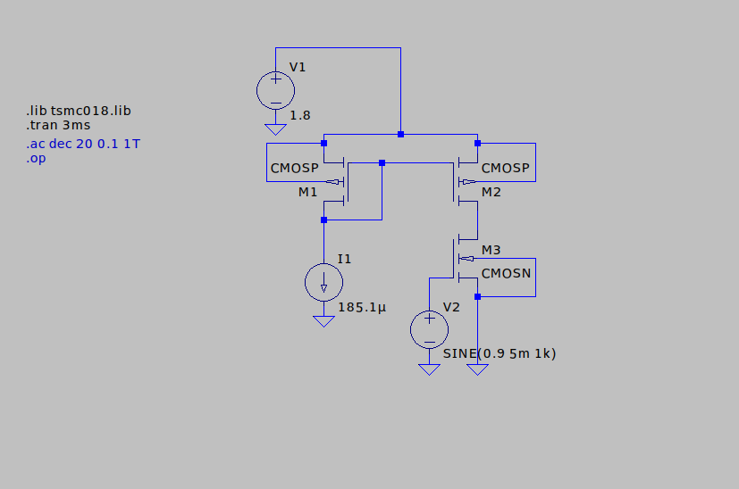

# 📡 CURRENT MIRROR
## 🎯 Aim
Design and analyze current mirror circuit as active load in amplifier circuit

The analysis includes:

✅ DC Analysis

✅ Transient Analysis

✅ AC Analysis

## Theory
**What is Current Mirror?**

The current mirror is an analog circuit that senses the reference current and generates the copy or number of copies of the reference current, with the same characteristics. The replicated current is as stable as the reference current source. The replicated current could be the same as the reference current (Icopy = IREF), or it could be either multiple or fraction of the reference current. (Icopy = N*Iref or Icopy = (1/N)*IREF).

 

**MOSFET- Current Mirror**

Fig.3 shows a current mirror circuit using the NMOS transistor. The reference current is converted to the voltage using diode connected transistor and the same is applied between the gate and the source of the another MOSFET.

The relation between the ID1 and IREF can be given by the following expression.

By changing the W/L ratio of the two transistors, the current which is fraction or multiple of the reference current can be generated. The only thing which needs to be ensured is that, the MOSFET should operate in the saturation region

**PMOS Current Mirror**

Fig. 6 shows the implementation of current mirror using the PMOS transistors. In PMOS current mirror, the source terminals for both transistors are connected to Supply voltage Vdd.

The relation between the ID1 and IREF can be given by the same expression.

## Circuit

## 🔍 DC Analysis

## 🔍 Transient Analysis.

## 🔍 AC Analysis.

## 📊 Results

1. DC Operating Point:

2. Transient Analysis:

3. AC Analysis:

## 📉Inference:

## ⚡ Conclusion:
