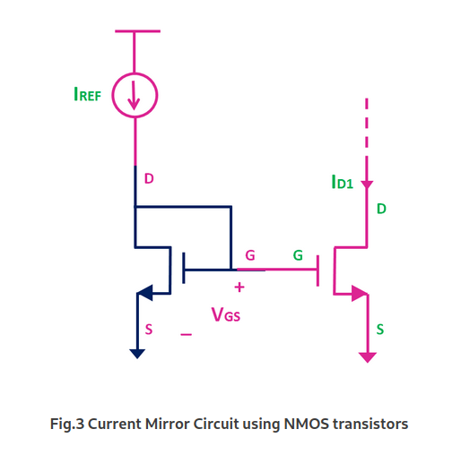

# 📡 CURRENT MIRROR
## 🎯 Aim
Design and analyze current mirror circuit as active load in amplifier circuit

The analysis includes:

✅ DC Analysis

✅ Transient Analysis

✅ AC Analysis

## Theory
**What is Current Mirror?**

The current mirror is an analog circuit that senses the reference current and generates the copy or number of copies of the reference current, with the same characteristics. The replicated current is as stable as the reference current source. The replicated current could be the same as the reference current (Icopy = IREF), or it could be either multiple or fraction of the reference current. (Icopy = N*Iref or Icopy = (1/N)*IREF).

 

**MOSFET- Current Mirror**

Fig.3 shows a current mirror circuit using the NMOS transistor. The reference current is converted to the voltage using diode connected transistor and the same is applied between the gate and the source of the another MOSFET.

The relation between the ID1 and IREF can be given by the following expression.

By changing the W/L ratio of the two transistors, the current which is fraction or multiple of the reference current can be generated. The only thing which needs to be ensured is that, the MOSFET should operate in the saturation region

**PMOS Current Mirror**

Fig. 6 shows the implementation of current mirror using the PMOS transistors. In PMOS current mirror, the source terminals for both transistors are connected to Supply voltage Vdd.

The relation between the ID1 and IREF can be given by the same expression.

## Design

To find total current:

**Itotal = P / VDD = 1 mW / 1.8 V = 0.555 mA**

---

### Current Division:

We know:

**Itotal = Iref + IX**, where **IX = ID**

- For (W/L) = 1:1 →  
  **Iref + IX = Itotal / 2 = 0.277 mA**

- For (W/L) = 1:2 →  
  **IX = Itotal / 3**

---

### Voltage Gain & Output Resistance:

We use the gain equation:

**AV = -gm · Rout = -gm · (ro1 || ro2)**

Where:

- **ro1 = 1 / (λ₠· ID)**  
- **ro2 = 1 / (λ₂ · ID)**

Given:

- λ₁ = 1.382  
- λ₂ = 1.329  
- ID = 0.277 mA

Then:

**Rout = 1 / (ID · (λ₠+ λ₂)) = 1331.65 Ω ≈ 1.331 kΩ**

---

### Transconductance:

We use:

**gm = 2ID / VOV**

So:

**AV = (2ID / VOV) · Rout**

Given gain ≥ 10 V/V, we calculate:

**VOV = 0.0737 V**  
**VGS = VOV + Vt = 0.0737 + 0.496 = 0.569 V**

So, **required input voltage = 0.569 V**

---

### MOSFET Dimensions

| Transistor | Type | Width (W) | Length (L) |
|------------|------|-----------|------------|
| M1, M2     | PMOS | 10 µm     | 180 nm     |
| M3         | NMOS | 31.23 µm  | 180 nm     |

---

> λ-values were taken from the TSMC 180 nm technology `.lib` file (`PCLM` parameter).  
> These calculations ensure the amplifier operates with **AV ≥ 10 V/V** and **VGS = 0.569 V**.

## Circuit Diagram ##

## Circuit

## Design part
Total Current = I = 10^(-3)/1.8 A = 0.555 mA

a) Current ratio = 1:1

  I = Iref + Ix

  Iref = Ix = 0.277 mA

b) Current ratio = 1:2

  I = Iref + Ix

  2 * Iref = Ix = 0.3703 mA, Iref = 0.1851 mA
    
## CASE 1: When Length = 1um

## 🔍 DC Analysis

## 🔍 Transient Analysis.

## 🔍 AC Analysis.

## CASE 2: When Length = 180um

## 🔍 DC Analysis

## 🔍 Transient Analysis.

## 🔍 AC Analysis.

## CASE 3: When Length = 500um

## 🔍 DC Analysis

## 🔍 Transient Analysis.

## 🔍 AC Analysis.

## 📊 Results

1. When length = 1um

   a. width = 6.4719825um

2. 
1. DC Operating Point:

2. Transient Analysis:

3. AC Analysis:

## 📉Inference:

## ⚡ Conclusion:
