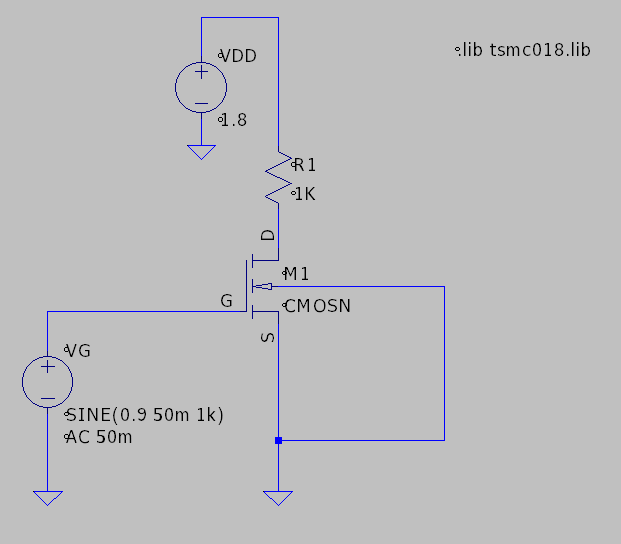

📢 COMMON SOURCE (CS) AMPLIFIER PROJECT  

📌 Overview
This project demonstrates the design, simulation, and analysis of a Common Source (CS) Amplifier. The CS amplifier is widely used in signal amplification due to its high voltage gain and moderate input impedance. LTSpice tools is used for the design and simulation. The library "tsmc018.lib" is used to set the parameter of the nMOS.
Power = 50 μW, Volage supply = 1.8V and Drain Resistance (RD) = 1kΩ is considered.

🎯 Objectives
✔️ Perform DC Analysis to determine the DC operating point of the circuit.
✔️ Conduct Transient Analysis to observe the time-domain response of the amplifier.
✔️ Execute AC Analysis to evaluate the frequency response and gain characteristics.
✔️ Extract Key Parameters including:
    DC Operating Point (biasing conditions of the MOSFET)
    Gain (voltage amplification factor)
    Bandwidth (frequency range where the amplifier operates effectively)
    Power Consumption (efficiency and performance assessment)

⚡ Circuit Description

🛠️ Simulation & Analysis

🚀 Steps to Run Simulation

📈 Results & Observations

🔎 Conclusion

🧐 Inference for CS Amplifier Project