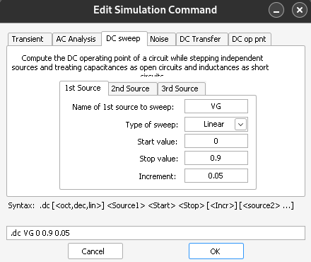

#📢 **COMMON SOURCE (CS) AMPLIFIER PROJECT**

##📌 **Overview**
This project demonstrates the design, simulation, and analysis of a Common Source (CS) Amplifier. The CS 
amplifier is widely used in signal amplification due to its high voltage gain and moderate input impedance. 
LTSpice tools is used for the design and simulation. The library "tsmc018.lib" is used to set the parameter 
of the nMOS.

Power = 50 μW, Volage supply = 1.8V and Drain Resistance (RD) = 1kΩ is considered.

##🎯 **Objectives**
✔️ Perform DC Analysis to determine the DC operating point of the circuit.
✔️ Conduct Transient Analysis to observe the time-domain response of the amplifier.
✔️ Execute AC Analysis to evaluate the frequency response and gain characteristics.
✔️ Extract Key Parameters including:
    DC Operating Point (biasing conditions of the MOSFET)
    Gain (voltage amplification factor)
    Bandwidth (frequency range where the amplifier operates effectively)
    Power Consumption (efficiency and performance assessment)

##⚡ **Circuit Description**

The components we require are
    1. N-channel Enhancement MOSFET (CMOSN)
    2. DC Supply Voltage = 1.8V (VDD)
    3. Resistor = 1kΩ
    4. AC Power Supply = 0.9V DC, 50mV sinusoidal signal (VG)

The MOSFET we use has a width (W) = 1.12 µm, length (L) = 180 nm.

##🛠️ **Procedure**
1. Set up the circuit and measure the DC Q-point as per given parameter.
2. Open LTSpice, select the nmos4 transistor , and make the connection as per circuit 
diagram given above.
3. Open the SPICE Directive and add tsmc018.lib by writing ".lib tsmc018.lib".
4. Perform DC, AC, transient, and DC operating point analyses for further evaluation.

##🚀 **Analysis**
**1. DC Operating Point**
   Given Power = 50 μW, Volage supply (VDD) = 1.8V and Drain Resistance (RD) = 1kΩ
   P = VDD x ID
   ID = 27.778 μA ----(1)
   VD = VDD - ID.RD
   VD = 1.7722 V ----(2)
   Vt = 0.3662 V (From tsmc018.lib file)
   VGD = 0.9 - 1.7722 = -0.8722 V
   Since VGD < Vt, MOSFET is in the saturation mode.
   Therefore, Operating point = (1.7722 V, 27.778 𝜇A) when VGS = 0.9 V.

   Steps for performing this analysis in LTSpice:
   a. Click the run icon in the toolbar and then click on the "DC operating point" tab. 
   b. Then click "Ok". 
   You will see the operation ---
   Here in above image we can see that ID = 27.77668 𝜇A and VD = 1.77223V which is approx. eqaul to the analysis we have done.

**2. Transient Analysis**
   For transient analysis we have to give an AC input signal for that right click on the voltage source VG,
   then select the "Advanced" option, then navigate to the SINE option. Set DC offset = 0.9 V, Amplitude (V) 
   = 50 mV (since, VGS << 2Vov), Frequency (Hz) = 1 kHz and on the small signal AC analysis (on the right 
   side of the interface) set the AC amplitude as 50m. 
   
   Steps for performing this analysis in LTSpice:
   a. Click the run icon in the toolbar and then choose on the "Transient" tab.
   b. Set stop time as 5m.
   c. Then run the simulation. ----
   This is the waveform ----
   In the waveform we can see that the peak voltage of the output signal is nearly 1.777 V and there is a
   phase shift of 180°.
   Then Av = -(Vout / Vin)
           = -(1.777/50m)
           = -35.54

**3. AC Analysis**
   For this also click on the Run icon and then choose the AC analysis tab and set
   a. Type of Sweep = Decade
   b. Number of points per decade = 20
   c. Start frequency = 0.1 Hz
   d. Stop frequency = 1 THz ----
   Click "ok" and then Run the simulation.
   This is the waveform ----

**4. DC Sweep**
   a. Transfer Characteristics
   We can plot the transfer characteristics by varying VGS and keeping VDS constant. To perform this click 
   the run icon in the toolbar and then choose on the "DC sweep" tab. Then set the name of 1st source to 
   sweep as "VG", the type of sweep as "Linear", start value as "0 V", stop value as "0.9V" and 
   increment as "0.05V". After this click "ok" and the Run the simulation.
   ----

   This is the waveform ---

   The voltage at which the current starts flowing through the MOSFET is around 360 mV = 0.36 V.
   This voltafe is nearly equal to the threshold voltage (Vt) from the tsmc018.lib file which is 0.3662473 V.

   b. Drain Characteristics
   We can plot the drain characteristics by varying VDS and keeping VGS constant. To perform this click 
   the run icon in the toolbar and then choose on the "DC sweep" tab. Then set the name of 1st source to 
   sweep "VDD", the type of sweep "Linear", start value "0V", stop value "1.8V"and increment "0.1V". After 
   this click "ok" and the Run the simulation.

   This is the waveform ----

   From the waveform we can see that the MOSFET is in triode region till somewhere between 0.4V to 0.6V. And
   then the saturation current ID is around 27 µA, which matches approximately with our calculated value of 
   27.778 µA.

   At different levels of VGS, from 0V - 0.9V with increment of 0.05V we get waveform as ----
   For this go to the DC sweep tab, and without changing the 1st source sweep parameters click on the 2nd 
   source to sweep tab, and set name of 2nd source to sweep = VG, type of sweep = Linear, start value = 0 V, 
   end value = 0.9 V, increment value = 0.05V. Then click “Ok”, and then click on “Run”.

   c. Voltage Transfer Characteristics
   To plot the Voltage Transfer Characteristics click the run icon in the toolbar and then choose on the "DC 
   sweep" tab. Then set the name of 1st source to sweep "VG", the type of sweep "Linear", start value "0V", 
   stop value "0.9V"and increment "0.05V". After this click "ok" and the Run the simulation.
   
   This is the waveform ----

**5. Variation of Parameters**
   a. Variation of ID with varying values of RD (10Ω – 1kΩ, with increments of 50Ω) –
      For this right click on the resistor R1, and change the value of the resistor from 1kΩ to {R}. This 
      changes the value of the resistor to a parameter, which can be varied between values. Then, using the 
      SPICE directive, type “.step param R 10 1k 50”, which tells LTSpice to vary R from 10Ω to 1kΩ, in 
      steps of 50Ω.
    
   b. Variation of ID with varying values of W (0.5µm – 1.5µm, with increments of 0.5µm)-
      For this right click on the MOSFET M1, and change the value of W from 1.12u to {w}. This changes the 
      value of the width to a parameter, which can be varied between values. Then, using the SPICE 
      directive, type “.step param w 0.5u 1.5u 0.5u”, which tells LTSpice to vary W from 0.5 µm to 1.5 µm in 
      steps of 0.5 µm.

   c. Variation of ID with varying values of L (50 nm – 200 nm, with increments of 10 nm)-
      For this right-click on the MOSFET M1, and change the value of the length from 180 nm to {l}. This changes the value of the length to a parameter, which can be varied between values. Then, using the SPICE directive, type “.step param l 50n 200n 25n”, which tells LTSpice to vary L from 50 nm to 200 nm, in steps of 25 nm.

##📊 **Results** 
   Drain Current (ID): ⚡ 27.7668 µA
   Drain-to-Source Voltage (VDS): 🔋 1.7723 V
   Gain (V/V): 📈 -35.54 V/V
   Gain (dB): 🎚️ -15.507 dB

##🧐 **Inference for CS Amplifier Project**
   The Common Source (CS) Amplifier was successfully designed, simulated, and analyzed using LTSpice with 
   the tsmc018.lib library for nMOS parameters. The key observations and conclusions from the analysis are:

    DC Operating Point Analysis:
        The calculated drain current (ID) ≈ 27.778 µA and drain voltage (VD) ≈ 1.7722 V match closely with the simulation results, confirming the accuracy of the biasing conditions.
        The MOSFET operates in saturation mode, ensuring amplification characteristics.

    Transient Analysis:
        The output waveform exhibits a clear phase shift of 180°, confirming the inverting nature of the CS amplifier.
        The measured voltage gain (Av) = -35.54 V/V, indicating significant signal amplification.

    AC Analysis:
        The amplifier shows a strong frequency response within the desired bandwidth.
        Gain remains consistent across the mid-band frequencies, ensuring effective signal amplification.

    DC Sweep Analysis:
        Transfer characteristics verify that the threshold voltage (Vt) from the simulation (~0.36 V) closely matches the given 0.3662 V from the tsmc018.lib file.
        Drain characteristics confirm the transition from triode to saturation region around VDS = 0.4V - 0.6V.
        Voltage Transfer Characteristics validate the amplifier’s ability to function effectively within the given biasing conditions.

    Parameter Variation Studies:
        Increasing RD results in a decrease in ID, confirming Ohm’s Law behavior.
        Increasing W enhances the drain current due to a larger conduction path.
        Increasing L reduces the drain current as expected, impacting the device’s transconductance.